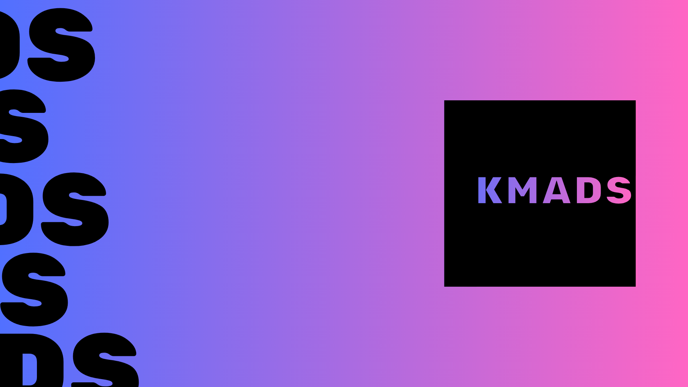
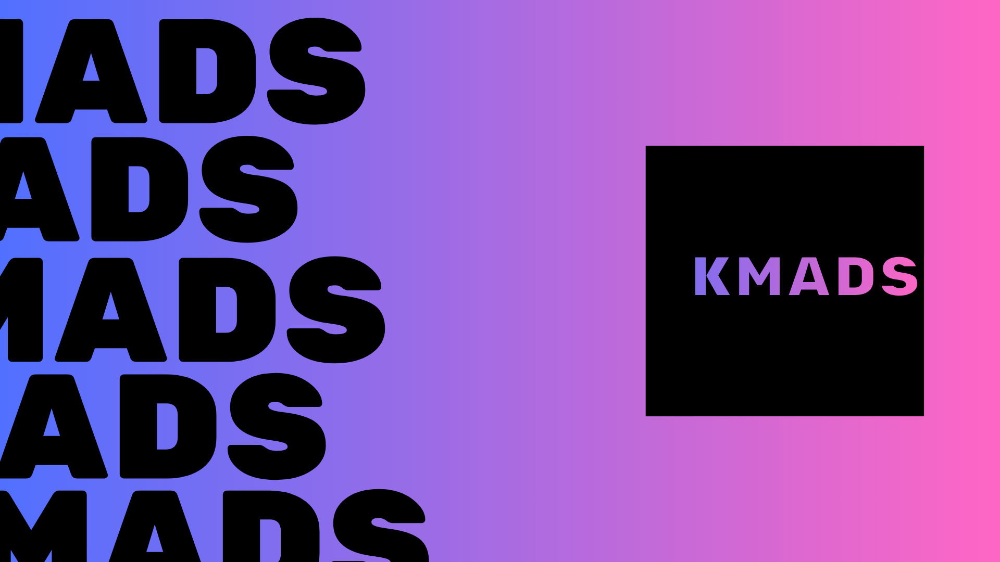
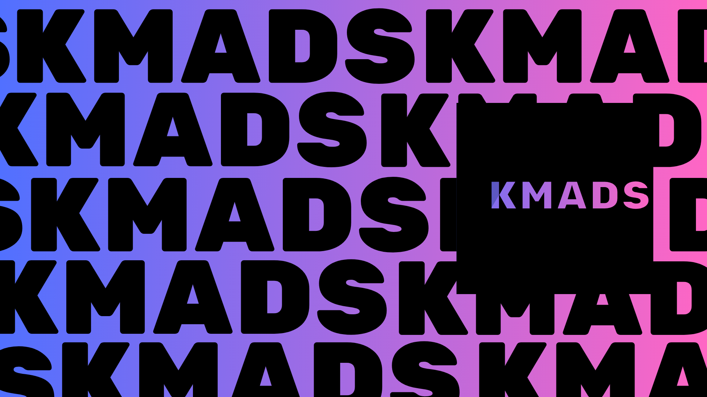

  
  
  
  
  

<button id="prevBtn">Previous</button>
<button id="nextBtn">Next</button>

- 👋 Olá, me chamo 'Kaique' e tenho 15 anos, obrigado por estar visitando meu perfil. Aqui estão mais informações sobre mim:
- 📆 Aprendendo sobre tecnologia desde 2018.
- 📚 1º Ano Tecnico (desenvolvimento de sistemas).
- 💻 Atualmente estudando: Python, Java, JavaScript, SQL, HTML & CSS, GIT e Linux.
- 💼 Já fiz projetos para o Discord, sites simples em HTML/CSS, jogos, livros e outras coisas.
- 🎨 Também sou designer (imagens em 2D e edição de videos), aprendendo a criar imagens, animações e modelos em 3D.
- 🤝 Tenha um ótimo dia.
