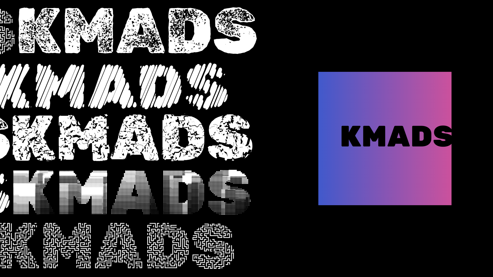
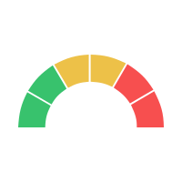
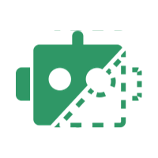

<!--  -->

<h1 align="left">Hi! My name is <strong>Kaique Souza</strong>, also know as <a ref="https://kmads.dev">KMADS</a></h1>

     &nbsp;
     &nbsp;
    

<table>
<tr><td valign="middle" align="left" width="50%">

I'm a Software Engineer with over 8 years of experience developing applications end-to-end to real users.

I'm particularly interested in 
- Distributed Systems / Microservices (if it's a monolith, better)
- SaaS development and deploy
- Software Architecture
- Backend systems.

</td><td valign="top" width="50%">

    

        
        
        
        
    

    

        
        
        
        
        
        
    

    

        
        
        
        
        
        
    

    

        
        
        
        
        
        
    

    

        
        
        
        
        
        
    

    

        
        
        
        
    

</td></tr>
</table>

<h3 align="center">Highlighted Projects</h3>

### ⏲️ OffMode

OffMode is a Pomodoro timer that keeps you locked in — it manages your work sessions and break intervals so you actually finish what you start.

**Acess it here: [https://kmads.dev/offmode](https://kmads.dev/offmode)**

 

### 🩺 Diabetes Indicator

Diabetes Indicator is a quick survey that estimates your probability of having diabetes, built to make health screening a little more accessible.

**Acess it here: [https://kmads.dev/diabetes-indicator](https://kmads.dev/diabetes-indicator)**

 

### 🎮 Doom Offline

Doom Offline is the legendary 1993 FPS compressed into a single HTML file — full levels, enemies, weapons, and soundtrack, all running straight in your browser. It weighs about 7MB total, but it's gzipped so your PC doesn't blow up, and your browser uncompresses it on the fly — completely offline, like magic.

**Acess it here: [https://kmads.dev/doom](https://kmads.dev/doom)**

 

### 📝 Browser Notes

Browser Notes is a VSCode-inspired text editor that lives entirely in your browser — one HTML file, no backend. Open, edit, and save files directly from disk, including Markdown, YAML, JSON, Swagger, and PlantUML diagrams. Files sync back automatically through the native file picker (Chrome/Edge) — no uploads, no accounts, no server.

**Acess it here: [https://kmads.dev/notes](https://kmads.dev/notes)**

 

### 🤖 Agentic Template

The Agentic Template is an all-in-one workspace template for building agents — multi-layer architecture, compliance gates, FinOps rules, CI/CD checks, code quality analysis, AI output benchmarking, SDD/TDD, Rule-as-Code, Skills and MCPs per project and per workspace, context/memory retrieval, and a lot more.

**Acess it here: [https://kmads.dev/agentic](https://kmads.dev/agentic)**

 

### 🎓 Engineer Student Tools

Engineer / Student Tools is a set of tools, software, cloud, courses, domains, AI, etc, that combined can save students up to $5,000 (or more). The packs covers Azure Cloud, Github Pro / Copilot Pro, JetBrains IDEs, Heroku, Datadog, Stripe, DataCamp, and more.

Acess it here: [https://github.com/kmadsdev/engineer-student-tools](https://github.com/kmadsdev/engineer-student-tools)

 

<h3 align="left">🧩 Challenges</h3>

- [PicPay Jr DevOps Challenge](https://github.com/kmadsdev/devops-challenge): Golang, Python, Redis
- [PicPay SWE Challenge I (Web)](https://github.com/kmadsdev/software-engineer-challenge-1): PHP, JavaScript, Redis
- [PicPay SWE Challenge II (TUI)](https://github.com/kmadsdev/software-engineer-challenge-2): PHP, Python, Redis
- [Harvard's CS50x 25' Challenges](https://github.com/kmadsdev/engineer-student-tools): C, JavaScript, Python

 

<h3 align="center">All Technologies & Tools</h3>

    
    
    
    
    
    
    
    
    
    
    
    
    
    
    
    
    
    
    
    
    
    
    
    
    
    
    
    
    <img alt="Canva" src="https://img.shields.io/badge/Canva-00C4CC.svg?style=for-the-badge&logo=" >
    
    
    
    
    
    
    
    
    
    
    <img alt="AWS" src="https://img.shields.io/badge/AWS-232F3E.svg?style=for-the-badge&logo=" >
    
    
    
    <img alt="ArgoCD" src="https://img.shields.io/badge/Argo%20CD-EF7B4D.svg?style=for-the-badge&logo=" >
    
    
    
    
    
    
    
    
    
    
    
    
    
    
    
    
    
    
    
    
    
    
    

